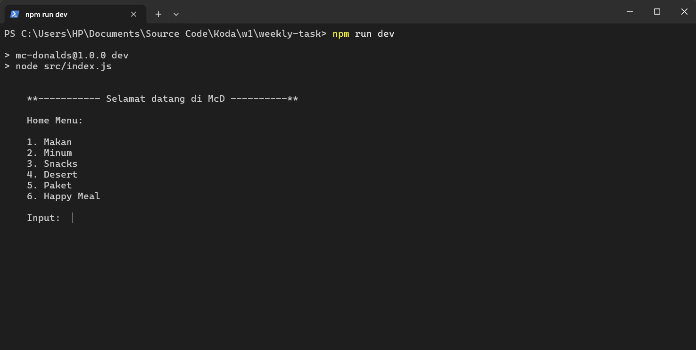
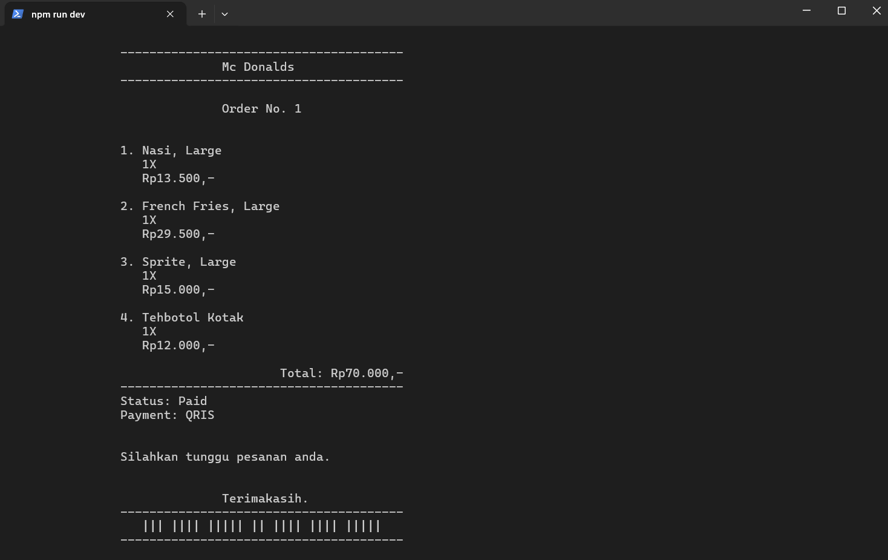
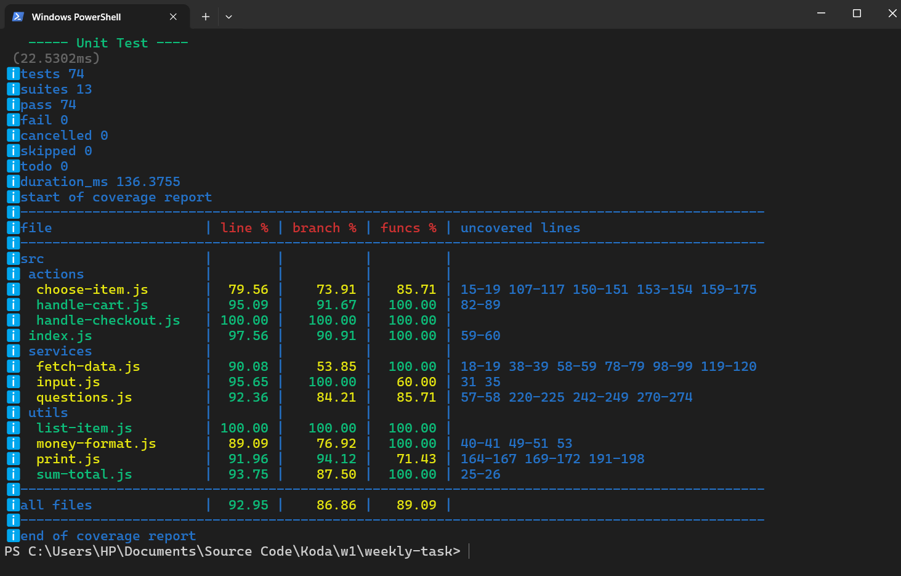

# McDonalds Clone

Program ini merupakan program clone sistem pesanan virtual McDonalds yang mana alur dari progam ini adalah pilih menu, checkout, bayar.

## Tech Stacks:
- Vanilla Js with ESM types
- test v10.x.x
- eslint v10.x.x

### Interactive menu menggunakan readline CLI yang dimana akan menanyakan user terkait list menu yang ditampilkan

Home Menu



### Readline services questions (first question)
```js
export async function init(
  params, 
  quest, 
  actionCallback,
  recoverCallback = init,
  ask = question
){
  try{
    if(typeof actionCallback !== 'function'){
      throw new Error(`\n\n   *Action callback must be a function`);
    }
    const result = await ask(params, quest);
    await actionCallback(result);
  } catch(err){
    console.log(err.message);

    // retry question
    if(shop.length > 0){
      return recoverCallback(params, handleHomeMenuText, handleHomeMenu);
    } else {
      return recoverCallback("", handleHomeMenuText, handleHomeMenu);
    }
  }
}
```
### Final program's flows state:


### Dan untuk testing program ini menggunakan package bawaan node:test untuk menangani unit-testnya.

Unit Test Coverage:
